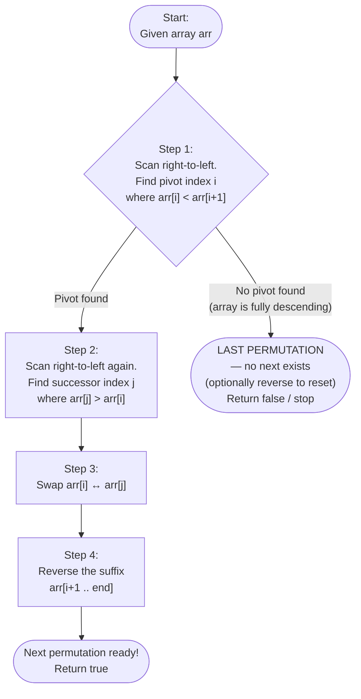

# Lexicographical Permutation Algorithm

## What is a Lexicographical Permutation?

A **permutation** is an arrangement of elements in a specific order.  
**Lexicographical order** is dictionary order — the same way words are sorted in a dictionary.

For example, all permutations of `[1, 2, 3]` in lexicographical order are:

```text
[1, 2, 3]  ← smallest (sorted ascending)
[1, 3, 2]
[2, 1, 3]
[2, 3, 1]
[3, 1, 2]
[3, 2, 1]  ← largest (sorted descending)
```

The algorithm finds the **next** permutation — the arrangement that comes immediately after the current one in this sorted list. **Each next permutation is the next bigger arrangement (132>123 - The next biggest number possible which keeping 1 in its place).**

---

## Core Idea

Starting from the right end of the array:

1. Find the first element that is **smaller than its right neighbor** — call it the **pivot**.
2. Find the **smallest element to the right of the pivot** that is still larger than it — call it the **successor**.
3. **Swap** the pivot and the successor.
4. **Reverse** everything to the right of where the pivot was — this makes the right portion as small as possible.

> If no pivot is found, the array is already the **last (largest) permutation**.

---

## Step-by-Step Algorithm

| Step | Action | Why |
| ------ | -------- | ----- |
| 1 | Scan from right → find index `i` where `arr[i] < arr[i+1]` | Locates the leftmost position that can still increase |
| 2 | If no such `i` exists → array is fully descending → last permutation | Nothing larger can be made |
| 3 | Scan from right → find index `j` where `arr[j] > arr[i]` | Finds the smallest value bigger than the pivot |
| 4 | Swap `arr[i]` and `arr[j]` | Increments the pivot position by the smallest possible amount |
| 5 | Reverse `arr[i+1 .. end]` | The suffix was descending; reversing it makes it ascending (smallest) |
| 6 | Result is the next permutation | Done |

---

## Flowchart



---

## Worked Example — `[1, 3, 2]` → next permutation

```text
Array:  [ 1,  3,  2 ]
Index:    0   1   2
```

**Step 1 — Find the pivot**  
Scan from right: Is `arr[1]=3 < arr[2]=2`? No. Is `arr[0]=1 < arr[1]=3`? **Yes** → pivot is at index `i = 0`, value `1`.

**Step 2 — Find the successor**  
Scan from right for first value > pivot (`1`): `arr[2]=2 > 1` → successor at index `j = 2`, value `2`.

<!-- markdownlint-disable-next-line MD036 -->
**Step 3 — Swap pivot and successor**

```text
[ 1,  3,  2 ]  →  swap(arr[0], arr[2])  →  [ 2,  3,  1 ]
```

**Step 4 — Reverse the suffix after index 0** (i.e., indices 1 to 2)

```text
[ 2,  3,  1 ]  →  reverse [3, 1]  →  [ 2,  1,  3 ]
```

**Result:** `[2, 1, 3]` ✓ — which is indeed the next permutation in the list above.

---

## Time & Space Complexity

|       | Complexity                                     |
| ----- | ---------------------------------------------- |
| Time  | O(n) — at most two linear scans + one reversal |
| Space | O(1) — all operations are in-place             |
